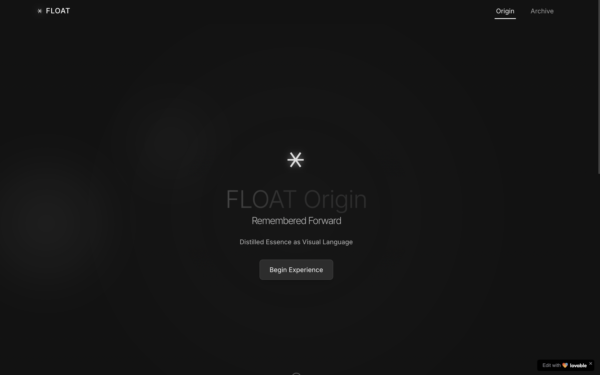

# FLOAT - Epistemic Nexus

- https://floating-epistemic-nexus.lovable.app/

FLOAT is a conceptual framework presented as an interactive digital experience. It explores epistemology, identity, and heresy through visual language and symbolic representation.

## Concepts

FLOAT articulates seven core concepts represented through glyphs and visual metaphors:

1. **Heresy as Interface** - Exploring unauthorized protocols as interfaces with forbidden truths
2. **Identity as Wayfinding** - Understanding the self as a compass forged in wandering
3. **Knowledge as Recursive Ritual** - Examining how knowledge must be callable, structurally and reverently
4. **Horror as Unstable Epistemology** - Considering how horror breaks models of knowing
5. **Liberation Through Breakdown** - Seeing how control systems collapse under recursive self-awareness
6. **Memory as a Live System** - Understanding memory as ritual architecture, responsive and evolving
7. **FLOAT Itself** - A way of surviving the archive, a rebellion staged in notation

## Screenshots

### Home Page


### Elements Overview


### Concept Detail


## Project info

**URL**: https://lovable.dev/projects/265faec4-5034-46e2-9fab-23e80a969d94

## How can I edit this code?

There are several ways of editing your application.

**Use Lovable**

Simply visit the [Lovable Project](https://lovable.dev/projects/265faec4-5034-46e2-9fab-23e80a969d94) and start prompting.

Changes made via Lovable will be committed automatically to this repo.

**Use your preferred IDE**

If you want to work locally using your own IDE, you can clone this repo and push changes. Pushed changes will also be reflected in Lovable.

The only requirement is having Node.js & npm installed - [install with nvm](https://github.com/nvm-sh/nvm#installing-and-updating)

Follow these steps:

```sh
# Step 1: Clone the repository using the project's Git URL.
git clone <YOUR_GIT_URL>

# Step 2: Navigate to the project directory.
cd <YOUR_PROJECT_NAME>

# Step 3: Install the necessary dependencies.
npm i

# Step 4: Start the development server with auto-reloading and an instant preview.
npm run dev
```

**Edit a file directly in GitHub**

- Navigate to the desired file(s).
- Click the "Edit" button (pencil icon) at the top right of the file view.
- Make your changes and commit the changes.

**Use GitHub Codespaces**

- Navigate to the main page of your repository.
- Click on the "Code" button (green button) near the top right.
- Select the "Codespaces" tab.
- Click on "New codespace" to launch a new Codespace environment.
- Edit files directly within the Codespace and commit and push your changes once you're done.

## What technologies are used for this project?

This project is built with:

- Vite
- TypeScript
- React
- shadcn-ui
- Tailwind CSS
- Framer Motion
- React Router

## How can I deploy this project?

Simply open [Lovable](https://lovable.dev/projects/265faec4-5034-46e2-9fab-23e80a969d94) and click on Share -> Publish.

## I want to use a custom domain - is that possible?

We don't support custom domains (yet). If you want to deploy your project under your own domain then we recommend using Netlify. Visit our docs for more details: [Custom domains](https://docs.lovable.dev/tips-tricks/custom-domain/)
